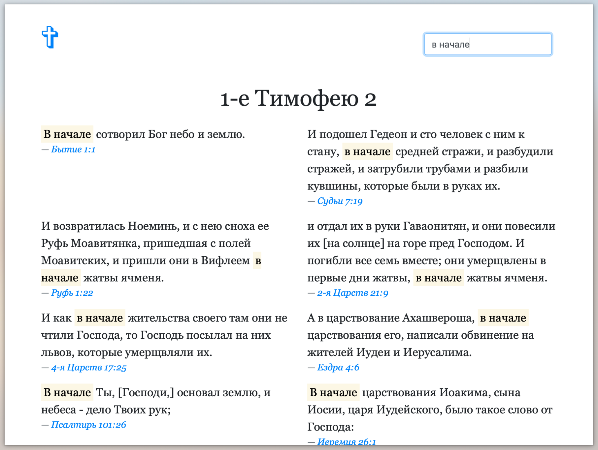

# Bible client in Java Script
## PoC stage

This is simple one page client to [Bible Microservice REST API in Rust](https://github.com/avdyushin/bible-search-rs)

## Usage

1. Run docker containers for the backend
2. Open index.html in browser

### Screenshots

#### Verses of The Day

#### Single Book Chapter

#### Search Results

